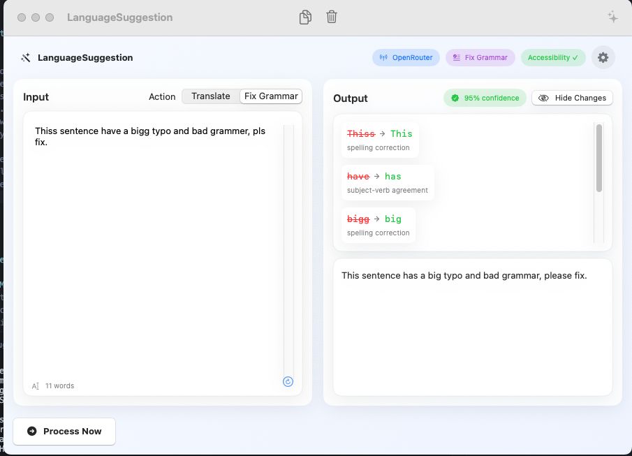
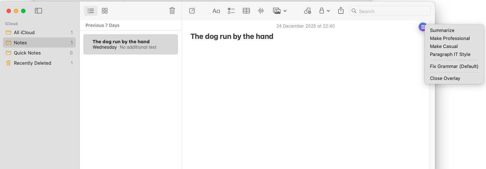
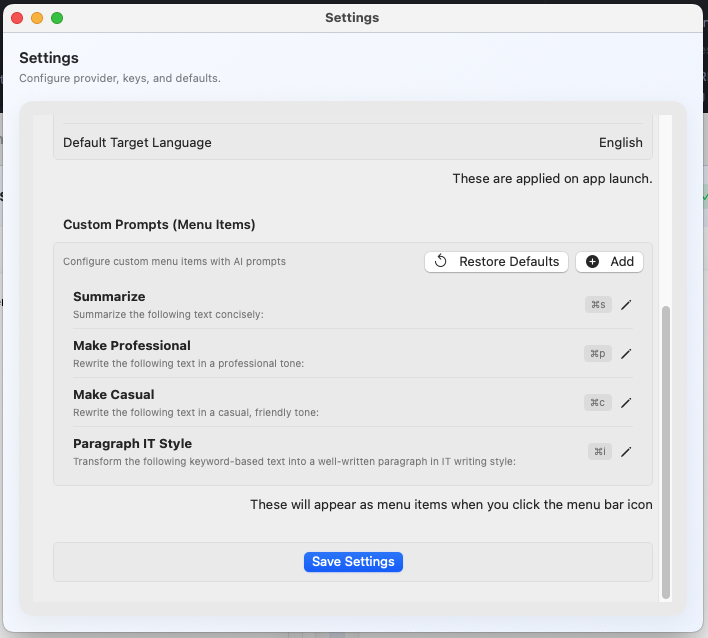

# LanguageSuggestion - macOS Native App

A native macOS desktop application built with SwiftUI and Xcode for translating text and fixing grammar errors using AI services (OpenAI and OpenRouter).



## Features

- ✨ **Dual AI Support**: Choose between OpenAI and OpenRouter
- 🌍 **Translation**: Translate text to any language
- ✏️ **Grammar Fixing**: Fix grammar and spelling errors
- 🎯 **Accessibility Integration**: Get text directly from Microsoft Teams and other apps
- 📊 **JSON Response**: Structured JSON responses for easy parsing
- ⚙️ **Settings**: Configure API keys and default preferences
- 🎨 **Modern UI**: Clean, native macOS interface with SwiftUI

## Requirements

- macOS 13.0 (Ventura) or later
- Xcode 15.0 or later
- Swift 5.9 or later
- API keys from OpenAI or OpenRouter

## Setup Instructions

### 1. Open in Xcode

1. Open Xcode
2. Select "File" > "New" > "Project"
3. Choose "macOS" > "App"
4. Set the following:
   - Product Name: `LanguageSuggestion`
   - Interface: `SwiftUI`
   - Language: `Swift`
   - Storage: `None`
5. Save the project in this directory

### 2. Add Files to Project

Add all Swift files to your Xcode project:
- `LanguageSuggestionApp.swift`
- `ContentView.swift`
- `SettingsView.swift`
- `APIService.swift`
- `Models.swift`
- `AccessibilityService.swift`
- `KeychainHelper.swift`
- `FloatingOverlayWindow.swift`
- `MenuBarManager.swift`

### 3. Configure API Keys

1. Run the app
2. Open Settings (⌘,)
3. Enter your OpenAI or OpenRouter API key
4. Select your preferred provider
5. Save settings

### 4. Get API Keys

**OpenAI:**
- Visit [OpenAI Platform](https://platform.openai.com/api-keys)
- Create an account and generate an API key

**OpenRouter:**
- Visit [OpenRouter](https://openrouter.ai/keys)
- Create an account and generate an API key

## Usage

### Basic Usage

1. **Input Text**: Type or paste your text in the left panel
2. **Select Action**: Choose "Translate" or "Fix Grammar"
3. **Set Language** (for translation): Enter target language
4. **Process**: Click the "Process" button or press ⌘+Return
5. **View Results**: See the processed text in the right panel
6. **View Changes**: Click "Changes" to see detailed corrections (for grammar fixing)

### Using Accessibility Features

LanguageSuggestion can automatically get text from other applications like Microsoft Teams:



*LanguageSuggestion menu integration in Notes and other macOS applications*

#### First Time Setup:
1. Click "Get from Teams" or "Get Focused Text" button
2. macOS will prompt you to grant Accessibility permissions
3. Click "Open System Settings"
4. In Privacy & Security > Accessibility, enable LanguageSuggestion
5. Return to LanguageSuggestion

#### Getting Text from Teams:
1. Open Microsoft Teams
2. Click on a text field or select some text
3. Switch to LanguageSuggestion
4. Click "Get from Teams" to get text from Teams specifically
5. Or click "Get Focused Text" to get text from any focused element

**Supported Apps:**
- Microsoft Teams (both classic and new version)
- Any macOS application with text fields
- Works with text editors, chat apps, email clients, etc.

## JSON Response Structure

The app expects AI responses in the following JSON format:

```json
{
  "originalText": "original text here",
  "processedText": "corrected/translated text here",
  "action": "Fix Grammar" or "Translate",
  "language": "English" (for translation, null for grammar),
  "changes": [
    {
      "original": "incorrect word",
      "corrected": "correct word",
      "reason": "explanation"
    }
  ],
  "confidence": 0.95
}
```

## Project Structure

```
LanguageSuggestion/
├── LanguageSuggestionApp.swift      # Main app entry point
├── ContentView.swift                # Main interface
├── SettingsView.swift               # Settings interface
├── APIService.swift                 # API integration
├── AccessibilityService.swift       # Accessibility API integration
├── Models.swift                     # Data models
├── KeychainHelper.swift             # Secure Keychain storage for API keys
├── FloatingOverlayWindow.swift     # Floating overlay window
├── MenuBarManager.swift             # Menu bar management
├── Info.plist                       # App configuration
├── README.md                         # This file
└── SECURITY.md                       # Security guidelines
```

## Features in Detail

### Translation Mode
- Translates text to any target language
- Shows confidence score
- Preserves original formatting

### Grammar Fix Mode
- Identifies and corrects grammar errors
- Shows detailed changes with explanations
- Highlights original vs corrected text

### Settings
- **Secure Keychain Storage**: API keys are stored in macOS Keychain (encrypted)
- Default action selection
- Default target language
- Provider switching
- **Custom Prompts**: Create custom prompts that appear in the menu bar for quick access



*Settings window showing API configuration and custom prompts that create menu support items*

### Accessibility Integration
- Get text directly from Microsoft Teams
- Access text from any focused UI element
- Automatic permission handling
- Support for both new and classic Teams
- Works with any macOS application that supports Accessibility API

## Troubleshooting

**API Key Error:**
- Ensure your API key is correctly entered in Settings
- Check that you have sufficient credits/quota

**JSON Parsing Error:**
- The app automatically handles markdown-wrapped JSON
- Ensure your API provider supports JSON mode

**Network Error:**
- Check your internet connection
- Verify API endpoints are accessible

**Accessibility Permission Issues:**
- Go to System Settings > Privacy & Security > Accessibility
- Make sure LanguageSuggestion is checked/enabled
- You may need to restart the app after granting permissions
- If permissions are granted but it's not working, try removing and re-adding the app in Accessibility settings

**Cannot Get Text from Teams:**
- Ensure Microsoft Teams is running
- Click on a text field in Teams before clicking "Get from Teams"
- Try selecting some text in Teams first
- If Teams detection fails, use "Get Focused Text" instead after clicking on the text field
- Make sure you're using the latest version of Teams (supports both classic and new Teams)

## Security

### API Key Storage

API keys are stored securely in the macOS Keychain using Keychain Services:
- Keys are encrypted and protected by the system
- Keys are never stored in plain text
- Automatic migration from UserDefaults (if upgrading from older versions)

### Security Best Practices

- **Never commit API keys** to the repository
- **Keep your keys private** - don't share them
- **Rotate keys regularly** for better security
- **Monitor API usage** to detect unauthorized access

For detailed security guidelines, see [SECURITY.md](SECURITY.md).

## License

Copyright © 2024. All rights reserved.

## Support

For issues or questions, please check:
- OpenAI API Documentation: https://platform.openai.com/docs
- OpenRouter Documentation: https://openrouter.ai/docs

